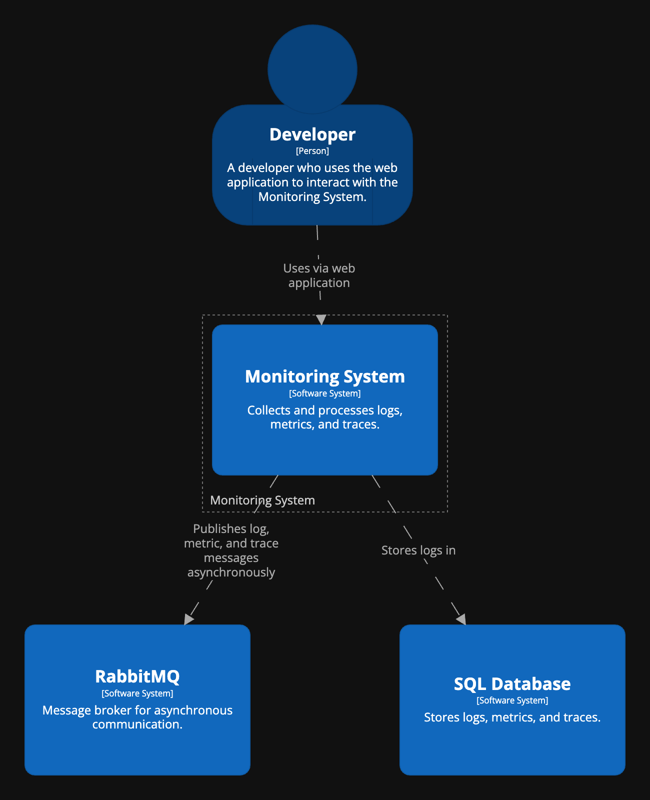
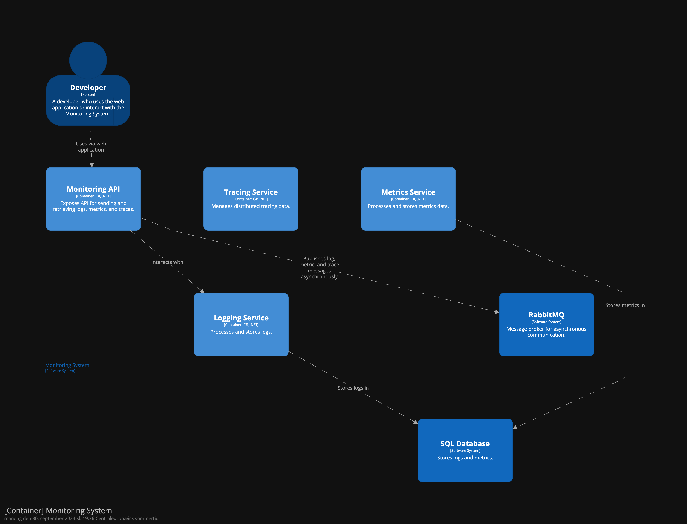
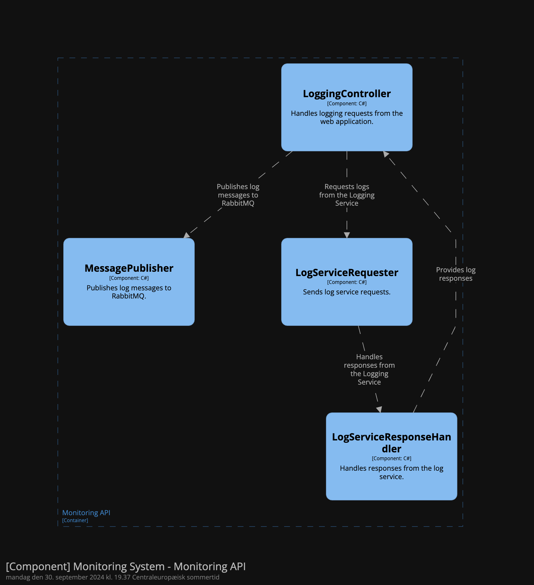
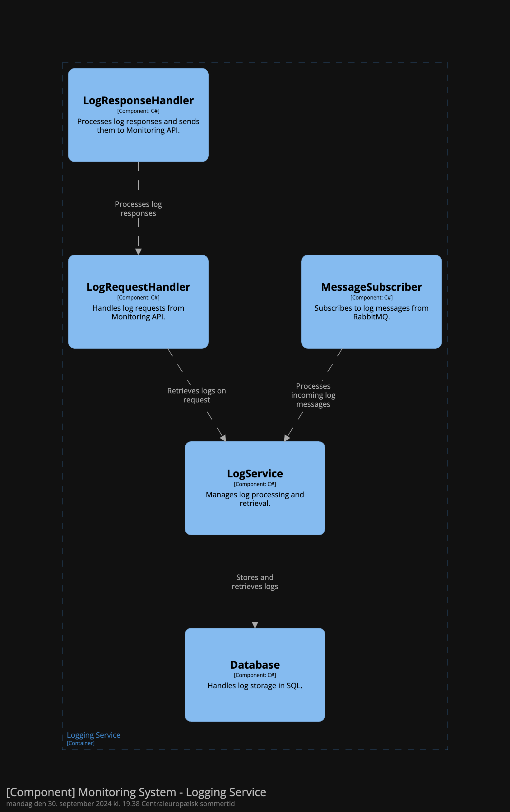
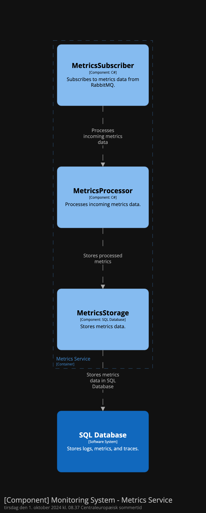
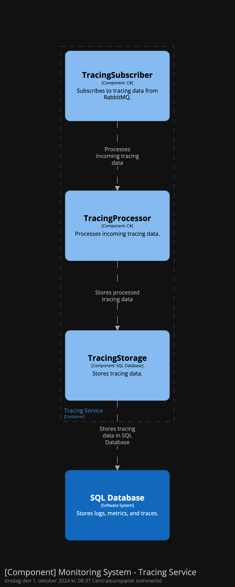

# Monitoring System

This project is a **Monitoring System** designed to collect and process **logs**, **metrics**, and **traces** from distributed services. The system leverages **Docker Compose** for container orchestration, and includes multiple services such as **Logging**, **Metrics**, and **Tracing**, which communicate asynchronously through **RabbitMQ**.

## Features

- **Logs**: Handles log messages and stores them in a SQL database.
- **Metrics**: Processes and stores metrics data.
- **Tracing**: Manages distributed tracing data for tracking interactions across services.
- **Asynchronous Messaging**: Uses **RabbitMQ** for communication between services.
- **Dockerized**: All services are containerized and orchestrated using **Docker Compose**.

## System Architecture

The **Monitoring System** is built using **C4 architecture** principles, breaking the system into containers and components. Below are the architecture diagrams explaining the system structure.

### Level 1: System Context Diagram

This diagram shows how the system interacts with external actors, such as the **Developer** who uses a web application to interact with the system.



### Level 2: Container Diagram

This diagram shows the different containers in the system, such as the **Monitoring API**, **Logging Service**, **Metrics Service**, **Tracing Service**, and how they interact with external systems like **RabbitMQ** and **SQL Database**.



### Level 3: Component Diagrams

Below are component diagrams for each container.

#### Monitoring API Component Diagram

This diagram shows the internal components of the **Monitoring API** container and their interactions.



#### Logging Service Component Diagram

This diagram shows the internal components of the **Logging Service** container.



#### Metrics Service Component Diagram

This diagram shows the internal components of the **Metrics Service** container.



#### Tracing Service Component Diagram

This diagram shows the internal components of the **Tracing Service** container.



## Getting Started

### Prerequisites

Make sure you have the following installed:

- [Docker](https://docs.docker.com/get-docker/)
- [Docker Compose](https://docs.docker.com/compose/install/)

### Clone the Repository

```bash
git clone https://github.com/PatrickJahn/EASV-MonitoringSystem.git
cd EASV-MonitoringSystem
```

### Run the System

1. **Start the services** using Docker Compose:

    ```bash
    docker-compose up --build
    ```

   This command builds and starts all the services, including the **Monitoring API**, **Logging Service**, **Metrics Service**, **Tracing Service**, **RabbitMQ**, and the **SQL Database**.

2. **Access the Services**:

   - **Monitoring API**: Accessible at `http://localhost:49152/swagger`.
   - **RabbitMQ Management UI**: Accessible at `http://localhost:15672`. Use the default credentials specified in the `docker-compose.yml` file.

### Stopping the System

To stop all services, run:

```bash
docker-compose down
```

This command will stop and remove the containers.

## Environment Variables

The system uses the following environment variables (defined in `docker-compose.yml`):

- **RABBITMQ_HOST**: RabbitMQ host (default: `rabbitmq`)
- **RABBITMQ_PORT**: RabbitMQ port (default: `5672`)
- **RABBITMQ_USER**: RabbitMQ username
- **RABBITMQ_PASS**: RabbitMQ password
- **DB_HOST**: Database host (default: `sql_db`)
- **DB_USER**: Database username (default: `sa`)
- **DB_PASS**: Database password (e.g., `SuperSecret7!`)

## Project Structure

```bash
.
├── MonitoringAPI/
│   ├── Controllers/
│   ├── Services/
│   ├── Dockerfile
│   └── ...
├── LoggingService/
│   ├── Services/
│   ├── Dockerfile
│   └── ...
├── MetricsService/
│   ├── Services/
│   ├── Dockerfile
│   └── ...
├── TracingService/
│   ├── Services/
│   ├── Dockerfile
│   └── ...
├── docker-compose.yml
└── README.md
```

- **MonitoringAPI/**: Contains the API for handling logs, metrics, and traces.
- **LoggingService/**: Responsible for processing and storing logs.
- **MetricsService/**: Responsible for handling metrics data.
- **TracingService/**: Manages tracing data.
- **docker-compose.yml**: Docker Compose file to orchestrate the services.

## Docker Compose Overview

Here’s a summary of the services defined in the `docker-compose.yml`:

- **Monitoring API**: The main API for interacting with the system.
- **Logging Service**: Handles logging operations.
- **Metrics Service**: Processes metrics data.
- **Tracing Service**: Manages tracing information.
- **RabbitMQ**: Message broker for asynchronous communication.
- **SQL Database**: Stores logs, metrics, and tracing data.
